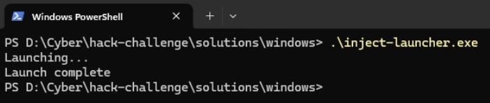
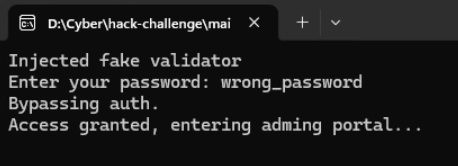

# Hack Challenge - Solutions

## Windows
TODO: Add solution process

The windows solution contains 2 files: [windows-injector.c](./windows/windows-injector.c) and [inject-launcher.c](./windows/inject-launcher.c)

The injector is responsible for injecting a malicious password validator into the admin program, while the launcher is responsible for injecting the DLL into the admin program. The DLL is the compiled ``windows-injector.c`` artifact. 

### Testing out the solution:

Running the launcher will start the admin process with the DLL injected.

The launcher should start a new console window with the admin process running. If the injector setup succeeds, authentication can finally be bypassed.

## Macos

## Linux
